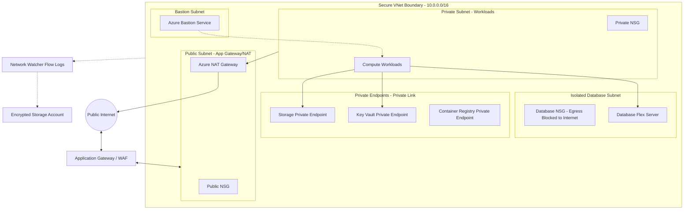

# Azure Super Secure VNet (VPC) Terraform Module

This repository contains a modular Terraform configuration to provision a highly secure Virtual Network (VNet) in Microsoft Azure. It follows standard cloud security guidelines for network segmentation, Network Security Groups (NSGs) boundaries, private service routing via Azure Private Link Endpoints, encrypted traffic auditing, and secure Azure Bastion host administration.

---

## ─── Security Controls & Architecture ───────────────────────────────



### Core Security Design:
1.  **3-Tier Subnet Zoning**:
    *   **Public Subnet**: Exclusively hosts public entryways (Application Gateways, WAFs) and NAT Gateways. Public IPs are not allowed in any other subnets.
    *   **Private Subnet**: Hosts application workloads (AKS, VM Scale Sets). Compute resources communicate outbound via the NAT Gateway.
    *   **Database (Isolated) Subnet**: Hosts stateful databases. It has no routes to the internet or NAT Gateways, blocking external exfiltration paths.
2.  **Stateful Network Security Groups (NSGs)**:
    *   **Public NSG**: Permits inbound HTTP/HTTPS (ports 80/443) from the public internet.
    *   **Private NSG**: Permits internal VNet traffic and routes outbound connections securely via the NAT Gateway.
    *   **Database NSG**: Restricts inbound database traffic (port 1433 for SQL Server, 5432 for PostgreSQL, 3306 for MySQL) strictly to private subnet ranges and explicitly denies all outbound routing to the internet.
3.  **VNet Flow Logs (Network Watcher)**:
    *   IP traffic passing through the NSG is audited and stored in a secure **Azure Storage Account**.
    *   The Storage Account enforces a minimum TLS version of **1.2** and restricts network access via Storage Firewall rules to allow only Private Link endpoints and verified Azure Services.
4.  **Azure Private Endpoints (Private Link)**:
    *   Allows virtual machines in private subnets to privately call PaaS APIs (Azure Key Vault, Storage Accounts, and Azure Container Registry) using private IP addresses. Public network routing to these PaaS services is blocked at their firewall levels.
5.  **Azure Bastion VM Tunneling**:
    *   Provides secure, browser-based RDP and SSH sessions to private compute VMs directly from the Azure Portal. Public SSH/RDP ports (e.g. `22`/`3389`) do not need to be open on VM security groups.

---

## ─── Getting Started ────────────────────────────────────────────────

### Prerequisites
- [Terraform](https://developer.hashicorp.com/terraform/downloads) (>= 1.5.0)
- [Azure CLI](https://docs.microsoft.com/en-us/cli/azure/install-azure-cli) configured and logged in:
  ```bash
  az login
  ```

### File Structure
- `providers.tf`: Provider setup and Key Vault features settings.
- `variables.tf`: Input configurations (CIDRs, environment names, location).
- `main.tf`: Resource Group, VNet, Subnets, NAT Gateway, and Bastion host logic.
- `nsg.tf`: Subnet-level Network Security Groups and rules.
- `keyvault.tf`: Key Vault configuration with strict Private Link ACLs.
- `endpoints.tf`: Private Link connections and DNS zoning.
- `logs.tf`: VNet Flow Logs and Storage Account logging.
- `outputs.tf`: Exports resource IDs and names.

### Usage

1.  **Initialize the configuration**:
    ```bash
    terraform init
    ```

2.  **Plan the deployment**:
    ```bash
    terraform plan -var="environment=prod" -var="location=centralindia"
    ```

3.  **Apply and provision**:
    ```bash
    terraform apply -var="environment=prod" -var="location=centralindia"
    ```
